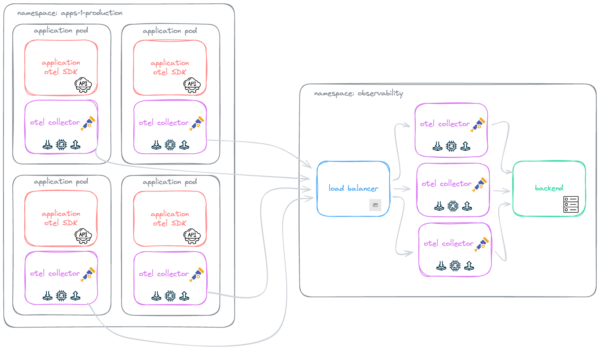

= Load balancing

Load balancing plays a crucial role in scenarios such as tail-based sampling. In the present context, load balancing involves considering the attributes of a data point to determine its destination. For instance, we may choose to implement a consistent hashing algorithm for a span, enabling us to decide the backend that should handle all spans from a particular trace.

It's important to note that this concept differs from the standard load balancing performed automatically by readily available tools.

.Load balancing based on trace IDs.

== Running

To deploy the OTEL collector as a sidecar, run:

    kubectl apply -f otel-collector-sidecar.yaml

To apply the OTEL collector load balancer, run:

    kubectl apply -f otel-collector-load-balancer.yaml

To apply the OTEL collectors behind the load balancer, run:

    kubectl apply -f otel-collector-behind-load-balancer-01.yaml
    kubectl apply -f otel-collector-behind-load-balancer-02.yaml

To deploy the application, run:
    
    kubectl apply -f vertx-create-span.yaml

To forward the application port to your local machine, run:

    kubectl port-forward -n all-applications pods/vertx-create-span 8080